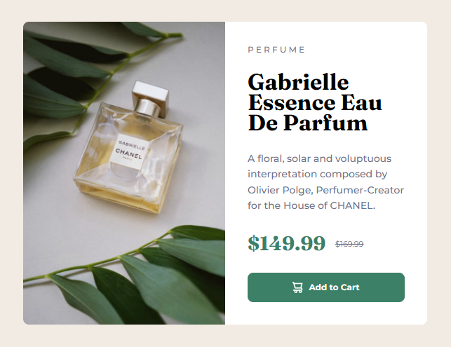
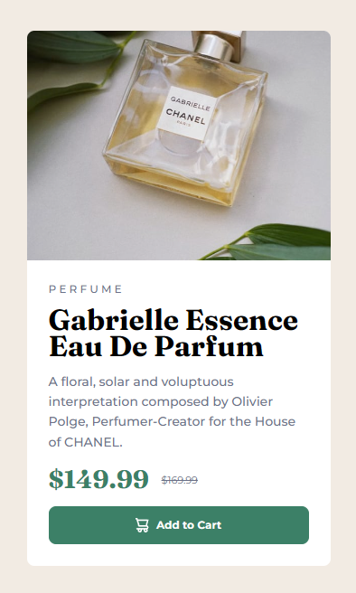

# Frontend Mentor - Product preview card component solution

This is a solution to the [Product preview card component challenge on Frontend Mentor](https://www.frontendmentor.io/challenges/product-preview-card-component-GO7UmttRfa). Frontend Mentor challenges help you improve your coding skills by building realistic projects. 

## Table of contents

- [Overview](#overview)
  - [The challenge](#the-challenge)
  - [Screenshots](#screenshot)
    - [Desktop](#desktop-version)
    - [Mobile](#mobile-version)
  - [Links](#links)
- [My process](#my-process)
  - [Built with](#built-with)
  - [What I learned](#what-i-learned)
  - [Continued development](#continued-development)

**Note: Delete this note and update the table of contents based on what sections you keep.**

## Overview

### The challenge

Users should be able to:

- View the optimal layout depending on their device's screen size
- See hover and focus states for interactive elements

### Screenshot

#### Desktop version

#### Mobile version

### Links

- Solution URL: [GitHub Repo](https://github.com/victorh18/product-preview-card-component-challenge)
- Live Site URL: [GitHub Pages](https://victorh18.github.io/product-preview-card-component-challenge/)

## My process

### Built with

- HTML
- CSS
- Flexbox

### What I learned

The most interesting thing I feel I learnt with this project is how different height works compared to width, even with Flexbox. This means that in your media queries, when adjusting your layout, you may have to write some more code than expected to get the desired results.

I also got the opportunity to practice importing local fonts to the page.

Also, I'm very proud of my button 🤘

### Continued development

My next goal for this project is using more advanced CSS features, like variables, and extend nesting where appropiate.

